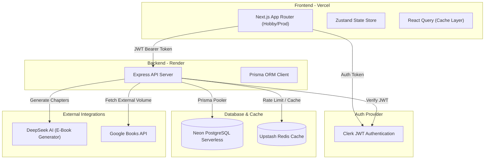

# 📚 BookHub — Enterprise-Grade Monorepo Reading Platform

BookHub is a high-performance, full-stack **Digital Library & Social Reading Platform** designed as a scalable **Turborepo Monorepo**. Built using Next.js, Express, serverless PostgreSQL (Prisma), and cached Redis, it features robust Clerk authentication and deep AI integration with DeepSeek and Google Books.

---

## 🏗️ Architectural Topology

BookHub utilizes a modern monorepo topology with isolated workspaces and shared packages.



---

## ⚙️ Monorepo Workspace Structure

```
BOOK_REVIEW_APP/
├── apps/
│   ├── web/                    # Next.js 15 App Router Frontend
│   │   ├── src/app/            # App routes (Dashboard, Library, Admin, Auth)
│   │   └── src/store/          # Zustand Auth & UI state stores
│   └── api/                    # Express.js + TS Backend API
│       ├── src/controllers/    # Route controllers (AI, Auth, Books, Reviews)
│       ├── src/middlewares/    # Auth (Clerk JWT), CORS Sanitizers, Error handlers
│       └── prisma/             # Neon Postgres Schemas & Migrations
└── packages/
    └── shared/                 # Shared TypeScript Type Definitions & Zod Schemas
```

---

## 💻 Tech Stack & Developer Tools

| Layer | Component | Description |
| :--- | :--- | :--- |
| **Monorepo** | Turborepo | High-performance build cache system & task runner |
| **Frontend** | Next.js 15 | App Router, Server/Client components, dynamic SSR |
| **Backend** | Express + TS | REST API server compiled & watched via `tsx` |
| **Auth** | Clerk Express | User identity and secure session management |
| **Database** | Neon Postgres | Serverless PostgreSQL with PGBouncer pooling |
| **Caching** | Upstash Redis | Low-latency caching for API rate-limiting |
| **ORM** | Prisma | Typesafe database client generation & migration tool |
| **Validation**| Zod | Shared frontend/backend API validation schemas |

---

## 🚀 Key Engineering Implementations

### 1. Auto-Cataloging on Demand (Google Books Linker)
When a user views details or requests an AI E-Book for a search result returned directly from the Google Books API, the backend automatically performs a non-destructive upsert. It connects categories and authors dynamically, and binds them to a unique record. This ensures users can instantly rate, write reviews, and post vibe checks on externally fetched books without duplicate data conflicts.

### 2. Resilient AI E-Book Generation
The E-book module requests DeepSeek to generate a complete chapter-by-chapter reading version of the book's content (at least 5 chapters, 1,500–2,000 words per chapter).
* **Fault Tolerance:** If the DeepSeek API fails (e.g., token balance limits, network timeout), the backend automatically catches the exception, logs it, and falls back to a high-quality mock chapter generation engine, ensuring `500` server errors are never exposed to the client.

### 3. Automated CORS Header Sanitizer
To prevent browser preflight checks (`OPTIONS`) from failing due to minor configuration discrepancies (like adding a trailing slash to environment variables on Render), the Express server runs a custom sanitizer middleware:
```typescript
let allowedOrigin = process.env.CLIENT_URL || "http://localhost:3000";
if (allowedOrigin.endsWith("/")) {
  allowedOrigin = allowedOrigin.slice(0, -1);
}
```

---

## 🔑 REST API Specifications

### Authentication Routes
* `POST /api/auth/register` — Create local user account matching Clerk ID.
* `POST /api/auth/login` — Sign in and create local session token.
* `POST /api/auth/refresh` — Refresh expired JWT token.

### Book & AI Routes
* `GET /api/books` — Fetch catalog books (supports filtering, search, pagination).
* `POST /api/books` — Store/import a book to the local database.
* `GET /api/books/:id` — Fetch detailed book information, stats, and reviews.
* `POST /api/books/:id/digital-book` — Retrieve or generate full AI E-book chapters.

### Review & Action Routes
* `POST /api/reviews` — Post a review (headline, vibe, rating, optional sticker badge).
* `POST /api/reviews/:id/like` — Toggle a like on a review.
* `POST /api/reviews/:id/report` — Report a review for moderation.

---

## 🛠️ Local Installation & Development

### 1. Clone & Bootstrap Workspace
```bash
git clone https://github.com/UnknownHawkins/BOOK_REVIEW_APP.git
cd BOOK_REVIEW_APP
npm install
```

### 2. Environment Variables

Create `/apps/api/.env`:
```env
DATABASE_URL="postgresql://neondb_owner:...&pgbouncer=true"
DIRECT_URL="postgresql://neondb_owner:..."
PORT=5000
NODE_ENV=development
JWT_SECRET="dev_secret_key"
DEEPSEEK_API_KEY="your_api_key"
GEMINI_API_KEY="your_api_key"
GOOGLE_BOOKS_API_KEY="your_api_key"
UPSTASH_REDIS_REST_URL="https://..."
UPSTASH_REDIS_REST_TOKEN="..."
NEXT_PUBLIC_CLERK_PUBLISHABLE_KEY="pk_test_..."
CLERK_SECRET_KEY="sk_test_..."
```

Create `/apps/web/.env.local`:
```env
NEXT_PUBLIC_API_URL=http://localhost:5000/api
NEXT_PUBLIC_SITE_URL=http://localhost:3000
NEXT_PUBLIC_CLERK_PUBLISHABLE_KEY=pk_test_...
CLERK_SECRET_KEY=sk_test_...
NEXT_PUBLIC_CLERK_SIGN_IN_URL=/auth/login
NEXT_PUBLIC_CLERK_SIGN_UP_URL=/auth/register
NEXT_PUBLIC_CLERK_SIGN_IN_FALLBACK_REDIRECT_URL=/
NEXT_PUBLIC_CLERK_SIGN_UP_FALLBACK_REDIRECT_URL=/
```

### 3. Run Dev Task
Run the parallel workspace developers:
```bash
npm run dev
```
* **Frontend:** [http://localhost:3000](http://localhost:3000)
* **Backend:** [http://localhost:5000](http://localhost:5000)
* **API Documentation:** [http://localhost:5000/api/docs](http://localhost:5000/api/docs)

---

## 🌐 Production Deployment Flow

### Next.js Frontend (Vercel)
1. Set the **Root Directory** to `apps/web`.
2. Turn ON **"Include files outside of the Root Directory in the Build Step"**.
3. Set **Build Command** to:
   ```bash
   cd ../.. && npx turbo run build --filter=bookhub-web
   ```
4. Set **Output Directory** to Default (`.next`).

### Express API (Render)
1. Create a **Web Service** with **Root Directory** set to `apps/api`.
2. **Build Command:** `npm install && npx prisma generate`
3. **Start Command:** `npx tsx src/index.ts`
4. Set `CLIENT_URL` env variable to Vercel's live deployment URL (no trailing slash).
